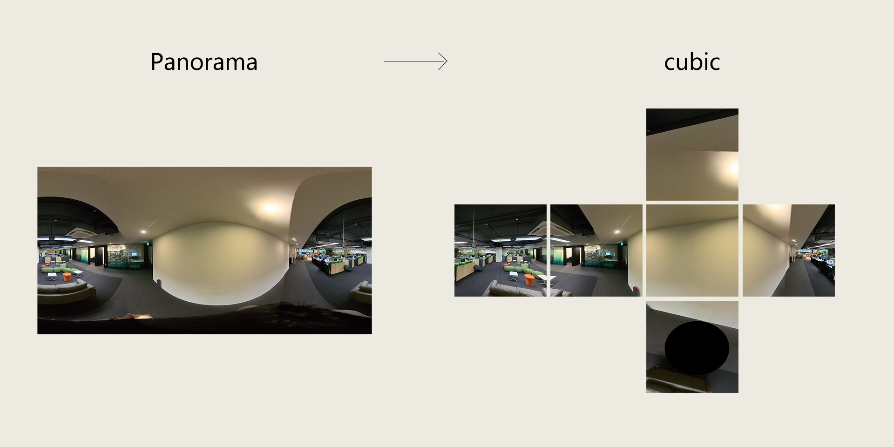

# 全景图转立方体贴图转换工具


一个用于将等距柱状投影全景图转换为立方体六面贴图的批处理工具。

## 功能特点

- 支持批量处理多个全景图像
- 自动将全景图转换为六个面的立方体贴图
- 保持图像质量和方向的正确性
- 支持多种图像格式（PNG, JPG, JPEG）

## 环境要求

- Python 3.x
- OpenCV (cv2)
- NumPy
- Pillow (PIL)
- py360convert

## 安装依赖

```bash
pip install opencv-python numpy Pillow py360convert scipy

## 使用方法
1. 准备输入和输出目录：
   
   - 创建输入目录，放入需要转换的全景图
   - 指定输出目录，用于保存转换后的立方体贴图
2. 修改脚本中的目录路径：
```python
input_dir = '你的输入目录路径'
output_dir = '你的输出目录路径'
 ```

3. 运行脚本：
```bash
python pano2persp.py
 ```

## 输出说明
程序会为每个输入的全景图生成6个面的图像：

- {原文件名}_cube_F.jpg - 前面 (Front)
- {原文件名}_cube_R.jpg - 右面 (Right)
- {原文件名}_cube_B.jpg - 后面 (Back)
- {原文件名}_cube_L.jpg - 左面 (Left)
- {原文件名}_cube_U.jpg - 上面 (Up)
- {原文件名}_cube_D.jpg - 下面 (Down)
## 致谢
本项目使用了 py360convert 库进行全景图转换。